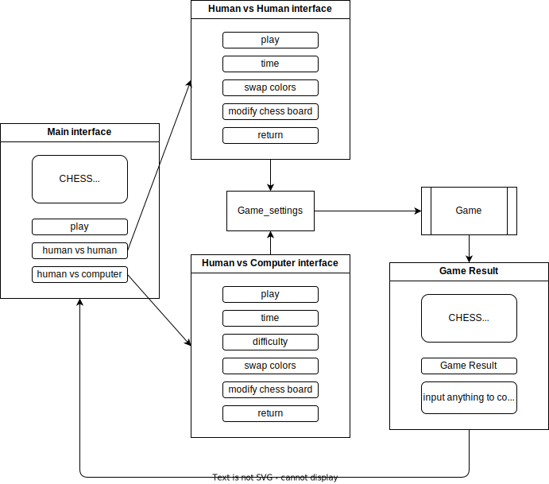

<!--
 Copyright (C) 2023 José Enrique Vilca Campana

 This program is free software: you can redistribute it and/or modify
 it under the terms of the GNU Affero General Public License as
 published by the Free Software Foundation, either version 3 of the
 License, or (at your option) any later version.

 This program is distributed in the hope that it will be useful,
 but WITHOUT ANY WARRANTY; without even the implied warranty of
 MERCHANTABILITY or FITNESS FOR A PARTICULAR PURPOSE.  See the
 GNU Affero General Public License for more details.

 You should have received a copy of the GNU Affero General Public License
 along with this program.  If not, see <http://www.gnu.org/licenses/>.
-->

# Contributing

## Interface Flow of the App

human vs computer and human vs human interfaces generate a game_setting object that will be used to configure the game.

## TODO's

install the todo app in vscode.

## Other

This is the command I use to build the release build type.
```bash
cmake -S . -B ./build && cmake -DCMAKE_BUILD_TYPE=Debug ./build && cd ./build && make -j $(nproc) && ./UCSP_Chess
## OR, build like any other project, it builds in Debug by default
cmake -S . -B ./build && cmake --build ./build && cd ./build && make -j $(nproc) && ./UCSP_Chess
```

some aliases that might improve your life quality. Add these in your `.bashrc` or `.zshrc`
```bash
alias gbuild='cd ./build || cd ../build || cd ../../build'
alias cmors='rm -rf build && cmake -S . -B ./build && cmake --build ./build && gbuild && make -j $(nproc)'
alias cmors_debug='rm -rf build && cmake -S . -B ./build && cmake -DCMAKE_BUILD_TYPE=Debug ./build && gbuild && make -j $(nproc)'
alias cmors_release='rm -rf build && cmake -S . -B ./build && cmake -DCMAKE_BUILD_TYPE=Release ./build && gbuild all && make -j $(nproc)'
```

if you added the aliases to your profile you can build the project as follows:
```bash
cmors && ./UCSP_Chess # to default debug built type
cmors_debug && ./UCSP_Chess # to build the debug built type
cmors_release && ./UCSP_Chess # to build the release built type
```

     <!-- Stalemate - if not in check but no legal moves
    Correct threefold repetition claim
    Correct fifty-move rule claim
    Insufficient material
    Draw offer accepted -->

